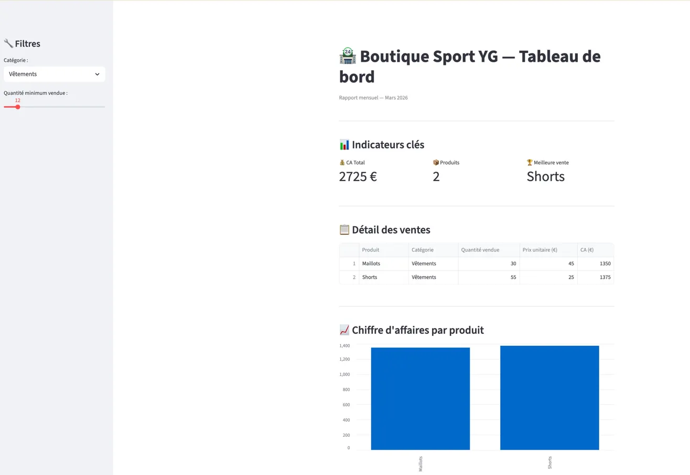

# Dashboard Boutique 📊




Application Streamlit de suivi des ventes pour petits commerces.  
Connexion base de données SQLite, graphiques interactifs et export PDF.
---

## 🚀 Fonctionnalités

- Tableau de bord des ventes en temps réel
- Connexion base de données SQLite
- Export PDF des rapports
- Interface simple et rapide (Streamlit)

---

## 🛠️ Technologies

- Python · Pandas · Streamlit · SQLite · ReportLab

---

## ⚙️ Installation

```bash
git clone https://github.com/Yann-Guibert/dashboard-boutique
cd dashboard-boutique
pip install -r requirements.txt
streamlit run dashboard_boutique.py
```

---

## 👤 Auteur

**Yann** — Data Analyst Freelance
